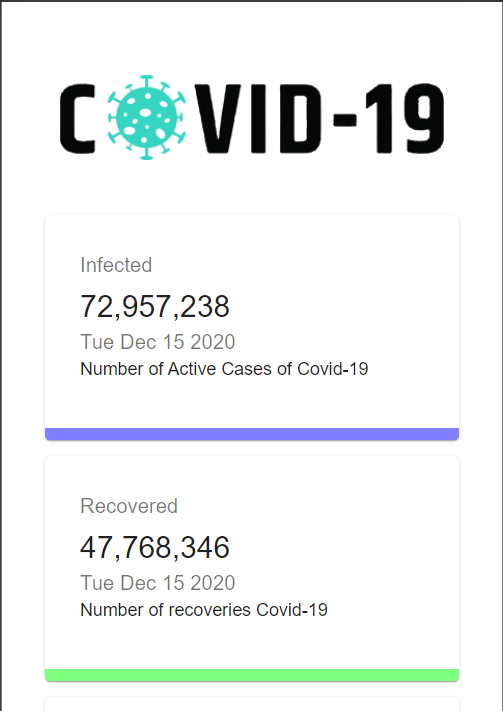
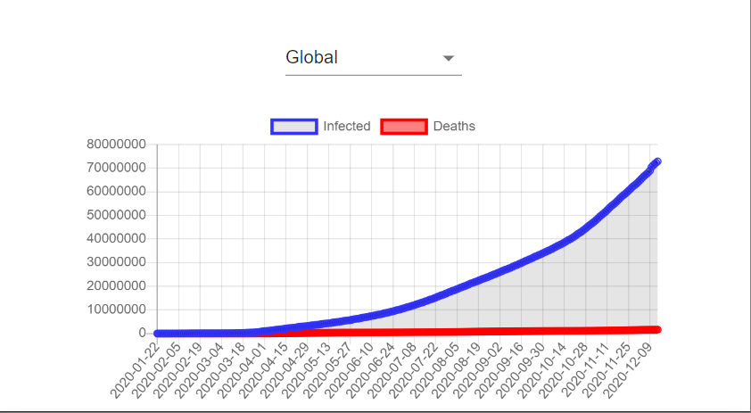
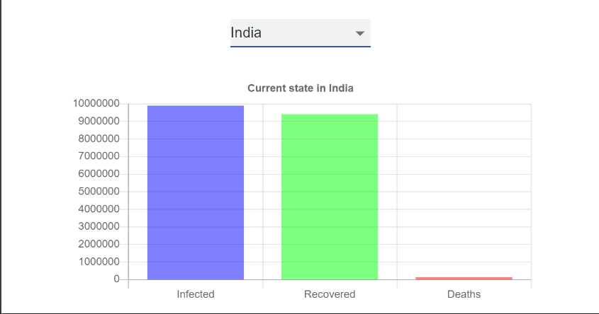

# Check out the site [here](https://aswinsampath1401.github.io/CoronaDashboard/)

# To run it on your local system 
- Download/ Clone the repo
- Open the folder in terminal
- npm i and npm start will open the app in localhost

# ScreenShots 

## Responsive in Mobile 

## Global Chart

## Country bar graph

